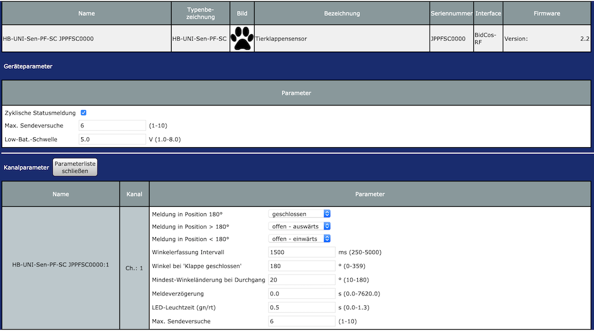

# HB-UNI-Sen-PF-SC
Universal Sensor for PetFlap

**Aufgabe** 
ist es, zu erkennen, ob das Haustier gerade kommt oder geht. 
Einerseits als reine Info-Benachrichtigung aufs Handy, andererseits zum Schalten von Aktoren in Abhängigkeit der Anwesenheit des Tieres.

Verbaut ist bei uns eine [SureFlap Haustierklappe](https://www.surepetcare.com/de-de/haustierklappen/mikrochip-haustierklappe) mit RFID (ohne App-Steuerung). 
_Den inneren Aufbau der SureFlap Katzenklappe findet man online zum [>>>Download<<<](https://fccid.io/XO9-DOOR-1001/Internal-Photos/Internal-Photos-1909838)._

Da ich weder an der eingebauten Elektronik etwas verändern/abgreifen wollte (um die Funktion nicht zu beeinträchtigen!) noch irgendwelche Kontakte außen anbringen möchte, habe ich mich für den ["magnetic rotary position sensor" AS5600](https://ams.com/documents/20143/36005/AS5600_DS000365_5-00.pdf) entschieden. 
Den bekommt man aus Fernost schon für wenig Geld (derzeit knapp 1,80 EUR bei [Aliexpress](https://de.aliexpress.com/item/4000140460377.html)).

**Umsetzung** 
war recht einfach.
An einem Ende der Klappenachse ist viel Freiraum. _siehe rotes Rechteck_

Es bot sich an, dort den Sensor zu platzieren.

**Wichtig: Der IC muss genau achs-mittig der Klappenachse gegenüberliegen!**

Für die Magnetaufnahme habe ich einen kleinen Adapter gedruckt. Gut in Heißkleber eingegossen sitzt dort ein [Neodym-Magnet](https://www.magnethandel.de/neodym-magnete-3-2-mm-n52), den ich noch zu liegen hatte.

**Betrieb** 

## to be continued
